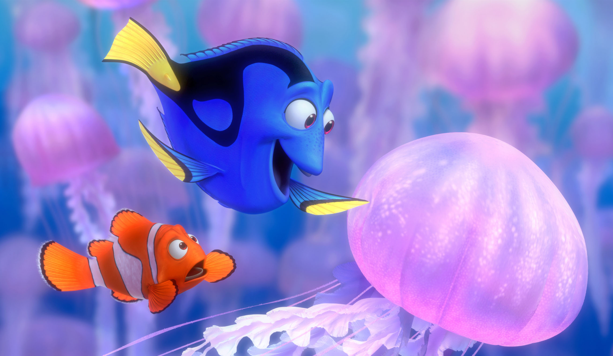

## 🌱 ME — Hi, I'm Evelyn -@EvelynKr -@evelynKim

### 안녕하세요😊 당신에게 선물같은 개발자 김나현입니다.

- 새로운 것을 공부하고, 시도하는 것을 좋아하며 뒤늦게 개발에 푹 빠져 공부를 시작한 프론트엔드 개발자입니다.
- 좋아서 시도했던 다양한 분야의 작은 것들이 쌓여 이후 문제들을 풀어나가는 것에 활용되어 좋은 결과를 만들어낼 때 재미를 느낍니다.

 

Personal Value

    

        

        "세상에는 `내`가 채울 수 있는 `틈`들이 무한히 존재한다고 생각합니다.   나는 그 틈을 채워나가는 `우리`가 되기를 기대합니다."
        

    

Interest

    

        

            I enjoy swimming, surf.
        

    

    
Finding Me

    

        

              
            "사는 게 힘들면 어떻게 하는 줄 알아?
            그냥 계속 헤엄쳐!"
            - 도리 <니모를 찾아서>  
            "When life gets you down, do you wanna know what you've gotta do?  
            Just keep swimming, swimming and swimming"
            - Dory, Finding Nemo
        

    

 

## 📬 CONTACT & CHANNEL

- Resume | getting ready...
- Portfolio | getting ready...
- Email | evelynkim.kr@gmail.com
- Github | https://github.com/evelynKr
- Blog | getting ready...

 

## ⚙ SKILLS

- Front-end : &nbsp;
  &nbsp;
  &nbsp;
  &nbsp;
  

- Back-end :

- Tools : &nbsp;
  &nbsp;
  

 

<!-- ## 🎓 EDUCATION & EXPERIENCES

### Multicampus(멀티캠퍼스)

_2022.04 ~ 2022.08_

- **부트캠프** 멀티캠퍼스 15기 활동

  -->

## 🧩 PROJECTS

 
